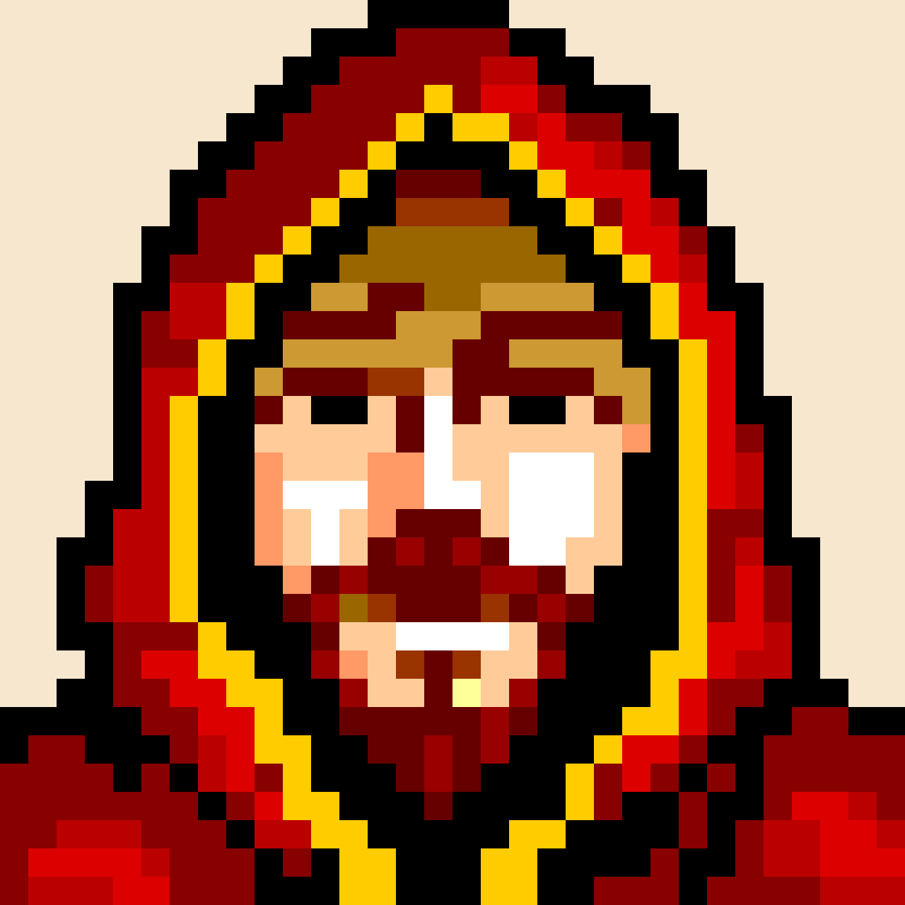

autoscale: true

# Hi 👋 Francis

---

# I'd like to add you to my decentralized network.

---

# `npx rc-chat`

### Node.js 8+
---

# RC-MINI 2

---

# Kademlia DHT

---

---

---

# Haven't really studied this hard in a long time

---

# Are we a decentralized network? 🤔

---

# Finding a Tech Job

1. There's you
1. You want to find a people with a job you like
1. You ask RC and they introduce you to great people (thanks Sydney!)
1. You ask about the job you want and they introduce you to more people who work in the industry
1. Eventually someone has the job you like
3. Later: You want to find a new job and you have a community to talk to

[.build-lists: true]
---

# Finding a Data in the swarm

1. There's you
1. You want to find a node with data you like
1. You ask RC and they introduce you to great nodes
1. You ask about the node you want and they introduce you to more nodes who are closer to the node you're looking for
1. Eventually someone has the data you want
1. Later: You want to find another node and you have a community to talk to

[.build-lists: true]

---

# Parts
1. Bootstrap
1. Peer lookup
1. K-Bucket address book keeps more info about closer people
1. Together we're statistically proven to make it work 🙌

[.build-lists: true]

---

# DEMO!?

---

# Thanks! 👋
#[fit] https://github.com/reconbot/rc-kademlia
